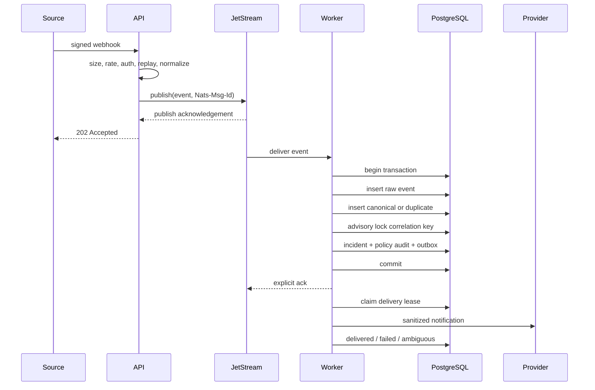
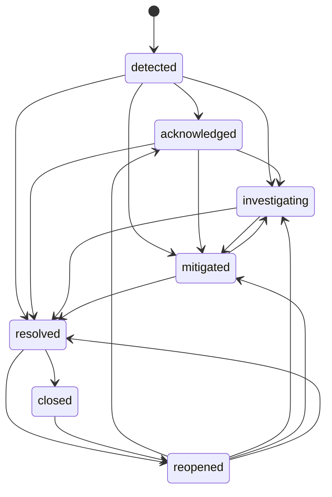

# Architecture

## Product definition

StormRelay is an incident control plane between unreliable event producers and human or automated response. Its first production-oriented slice focuses on preserving evidence, deterministic deduplication, correlation, acknowledgement, and audit rather than broad integration count.

## Component boundaries

- **Ingestion gateway:** validates request size, authentication, timestamp, replay cache, rate limit, content type, and event shape. It publishes a normalized envelope to JetStream and does not write incidents directly.
- **JetStream:** durable at-least-once handoff and backpressure boundary. The server waits for a publish acknowledgement.
- **Worker:** bounded pull consumer. It commits raw event, normalized event, deduplication result, incident correlation, policy decisions, notification outbox, and audit before acknowledging the message.
- **PostgreSQL:** source of truth. SQL remains explicit through pgx.
- **Notification dispatcher:** claims leased outbox rows with `FOR UPDATE SKIP LOCKED` and calls isolated adapters.
- **Runbook engine:** claims immutable execution-step snapshots with expiring PostgreSQL leases. Persisted waits and approvals do not occupy goroutines; uncertain non-idempotent outcomes become `ambiguous`.
- **Process plugins:** run outside the control-plane address space behind a versioned JSON protocol, exact host allowlists, DNS/IP validation, deadlines, bounded payloads, and idempotency-key verification.
- **API/CLI:** operational control surface. UI work is deferred and may never become a required dependency.

## Event processing sequence

## Incident state machine

All transitions pass through domain validation and create both an `incident_transitions` row and an append-only audit entry.

## Data model summary

Identity tables define tenants, users, teams, memberships, and API keys. Event tables separate raw bytes, normalized fields, and duplicate observations. Incident tables link canonical events and transitions. Policy and runbook definitions are immutable versions behind mutable active-version pointers. Executions pin a concrete runbook version and store immutable per-step snapshots, retry policy, timeout, lease state, output, sanitized error, and idempotency key. Notifications use durable delivery attempts. Audit entries cannot be updated or deleted through the application role because a database trigger rejects mutation.

## Consistency model

StormRelay deliberately uses at-least-once transport. The idempotency hierarchy is explicit key, source event ID, then fingerprint. The unique tuple is tenant, source, dedupe key, and time bucket. Correlation locks only one logical key, allowing unrelated services to continue if one key is hot.

External providers are outside the transaction. Their outcome can be ambiguous. The outbox records that ambiguity rather than inventing exactly-once semantics.

## Backpressure

The gateway receives backpressure from JetStream publish failures. The worker limits pull batch, outstanding acknowledgements, and local goroutines. PostgreSQL pool size is bounded. Poison messages have a finite delivery count and a dead-letter path.

## Deferred boundaries

OIDC, tenant-aware RBAC, web UI, OpenTelemetry SDK exporters, Helm, signing, and release provenance remain separate milestones. Generic shell execution is intentionally unavailable.
